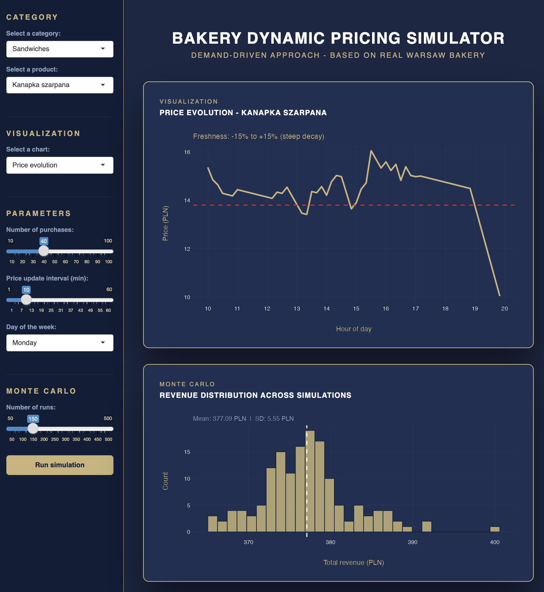

# DynamicBakeryPackageR

An R package simulating stock-market-style dynamic pricing for a Polish bakery (Lubaszka, Warsaw).
Prices adjust in real time based on three signals: demand pressure, remaining stock, and product freshness.

Built as part of the Advanced Programming in R course of the Data Science & Business Analytics Master at the University of Warsaw.

## Installation

From downloaded tar.gz file:

```r
install.packages("path/to/DynamicBakeryPackageR_0.1.2.tar.gz", repos = NULL, type = "source")
```

or from github repository

```r
install.packages("remotes")
remotes::install_github("lepvteo/DynamicBakeryPackageR")
```

> **Note:** Some email clients (e.g. Gmail on macOS) may automatically 
> decompress the `.tar.gz` into a `.tar` file. Both formats work with 
> `install.packages(..., repos = NULL, type = "source")`.

## Usage

```r
library(DynamicBakeryPackageR)

# Launch the interactive Shiny dashboard
run_app() or DynamicBakeryPackageR::run_app()

# Run a single simulation directly
simulator(product = kanapka_szarpana, bakery = lubaszka_solec, day = "mon", nb_purchase = 30)

# Run a Monte Carlo simulation (100 runs)
monte_carlo_simulation(product = kanapka_szarpana, bakery = lubaszka_solec, day = "mon", n_runs = 100)
```

## Dashboard



The interactive Shiny dashboard allows simulating a full bakery business day with dynamic pricing. The simulation can be adjusted by product category, total number of purchase, and price update interval. A built-in Monte Carlo engine runs multiple price path scenarios to visualize demand uncertainty across the day.

**Live demo available on [Posit Connect Cloud](https://lepvteo-dynamic-pricing-bakery-app.share.connect.posit.cloud)**


## Package structure

- `R/classes.R` — S4 class hierarchy (Bakery, Product, Bread, Sandwich, Pizza)
- `R/methods.R` — S4 generics and methods (pricing adjustments, demand, stock, freshness)
- `R/objects.R` - Bakery and product catalog instantiations (for shiny input)
- `R/run_app.R` - Shiny application optional launcher
- `R/simulation.R` — Core simulation engine and Monte Carlo wrapper
- `inst/app/app.R` — Shiny dashboard
- `data/` — Real attendance data from Google Maps Popular Times
